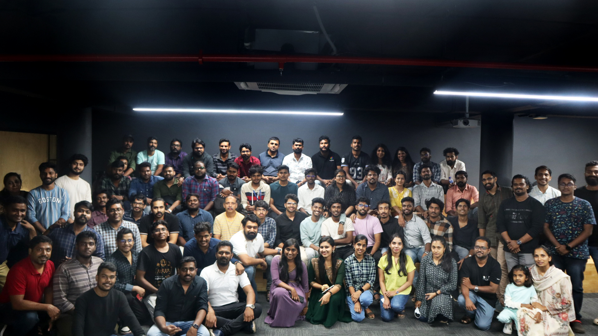
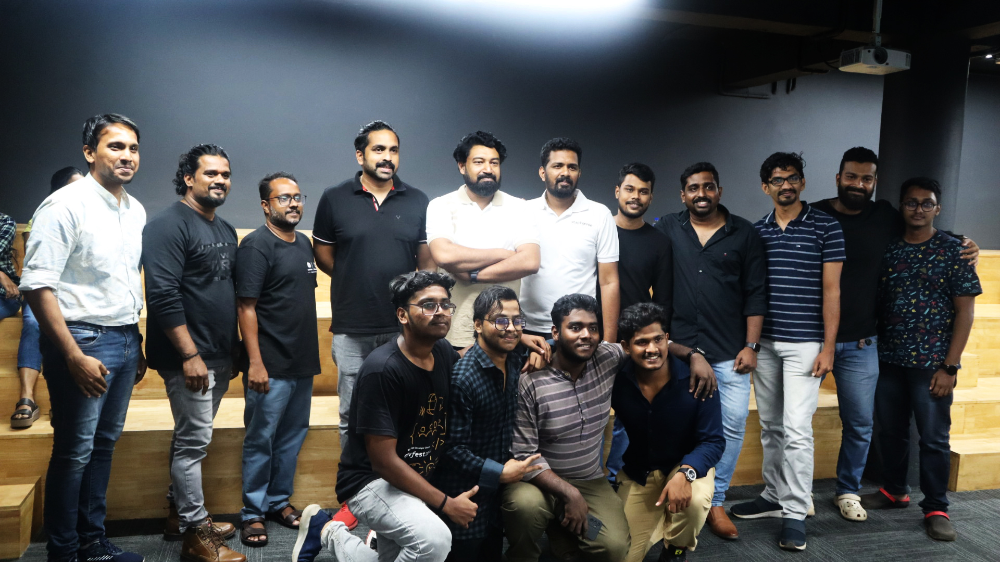
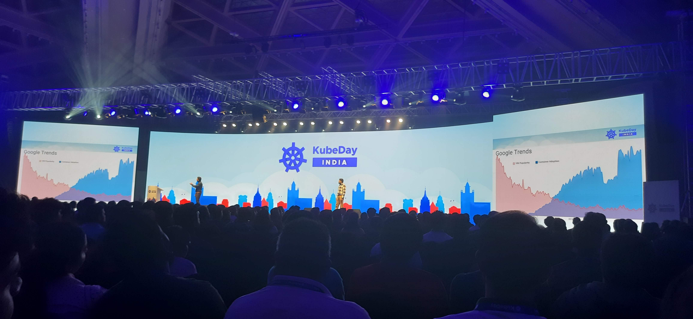
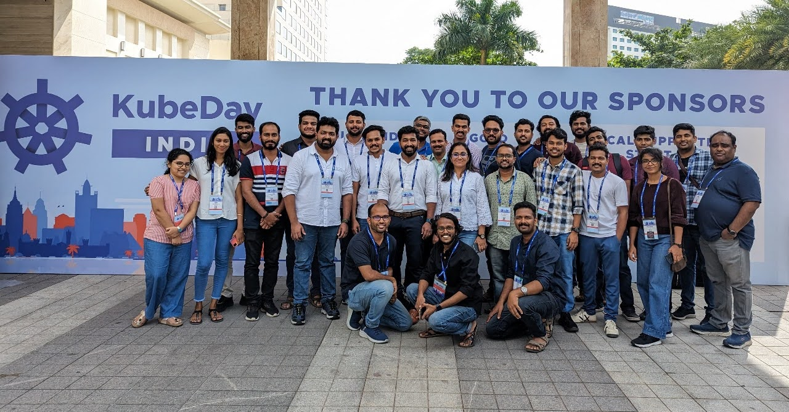
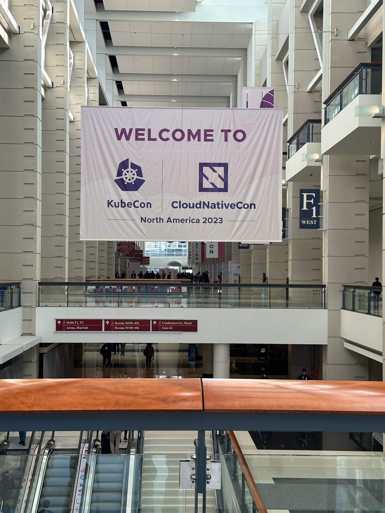
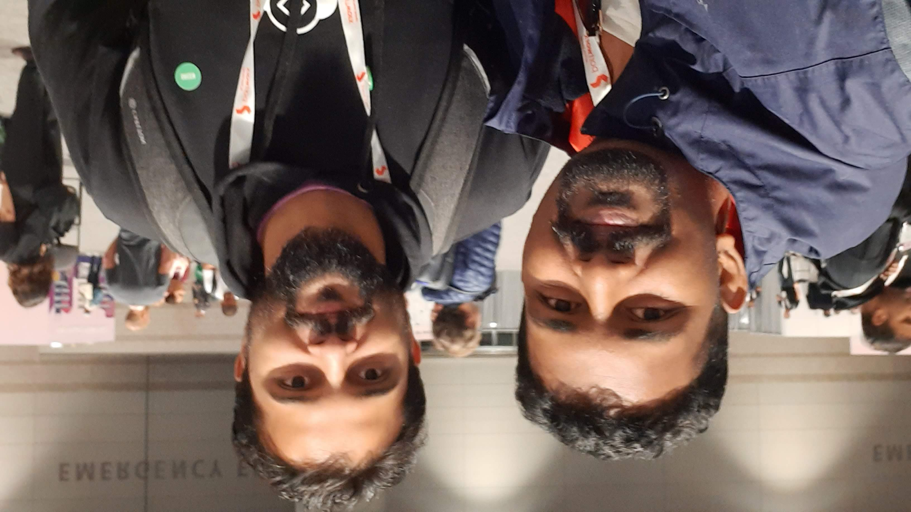
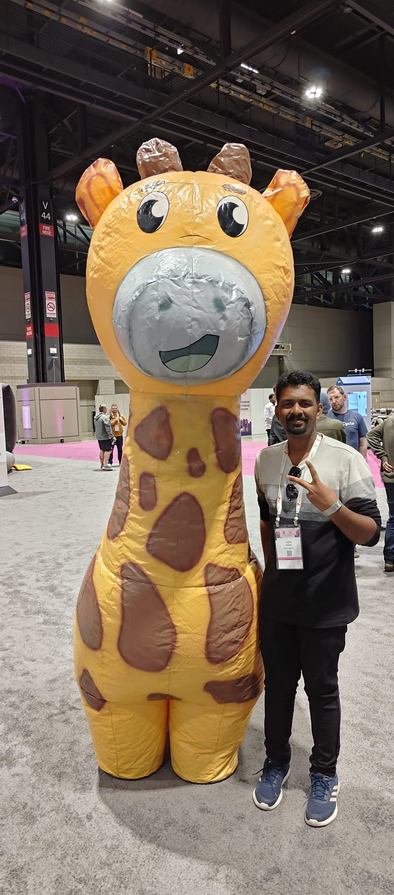
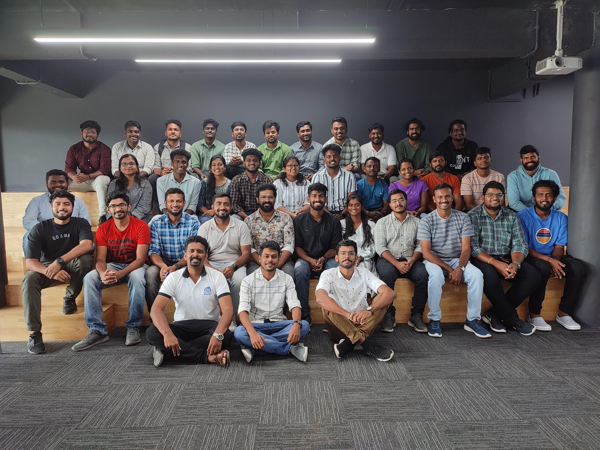

### 🌟 Discover the Pulse of Tech with Ebin Babu! 🌐

Greetings, tech enthusiasts! I'm **Ebin Babu**, a DevOps engineer at [stackgenie](https://stackgenie.io) who's on a mission to revolutionize the cloud-native landscape. As a co-founder of [devopsmalayalam.io](https://devopsmalayalam.io) and the organizer of the CNCG Trivandrum chapter community, I'm dedicated to fostering a vibrant, collaborative ecosystem for cloud-native enthusiasts like yourself.

In my role, I have the privilege of overseeing the day-to-day operations and ensuring that our events and initiatives run seamlessly. I've coordinated over 100 offline and online events, connecting passionate individuals from diverse backgrounds and helping them navigate the ever-evolving world of cloud-native technologies.

But my tech journey doesn't stop there! I'm a devoted open-source advocate and a Linux enthusiast, constantly exploring new ways to push the boundaries of what's possible. For me, the community is the heartbeat of this revolution, and I'm honored to be a part of it, bringing people together who share my passion for innovation and progress.

So, if you're ready to dive into the pulse of the tech universe, join me on this exciting journey! Let's collaborate, learn, and shape the future of cloud-native technologies, one milestone at a time. Together, we can unlock the boundless potential that lies ahead.

## Contacts
   

#### Badges

#  Here's a sneak peek of my offline events:

  <h2>Image Gallery</h2>

  
 February 23rd 2024 - CloudNative Trivandrum 

  
  

  
December 8 2023 - KubeDay 

  
  

  
November  6-9 2023 - kubecon cloud native con 

  
   
   

  
October 14, 2023 - DM-meetup-TVM

  

  
August 19, 2023 - DM-meetup-TVM

  
  

  
May 6, 2023 - DM-meetup-Kochi

  
  
  

 
April 29, 2023 - WOW Kerala organized by GDSC

   
   
   

 April 3, 2023 - Student Advising Meeting 

 March 25, 2023 - DM-meetup-TVM 

 May 21, 2022 - DM-con 2022 

 April 09, 2022 - CNCF Trivandrum 

 March 10, 2022 - Cloud && DevOps Mentoring Session 

